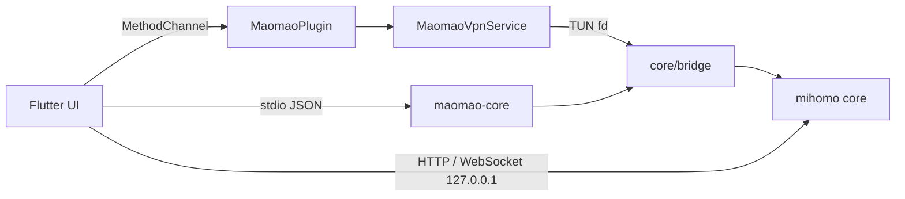

# maomao

基于 [mihomo](https://github.com/MetaCubeX/mihomo) 内核的代理客户端，使用 Flutter 编写界面，支持 Android、Windows 与 macOS（仅 Apple Silicon）。

## 项目结构

```
core/                Go 侧内核封装
  bridge/            对宿主暴露的稳定 API（Android 走 gomobile 绑定）
  cmd/maomao-core/   桌面 sidecar 进程入口（stdio JSON 协议）
  Makefile           AAR / exe / Mach-O 构建脚本
app/                 Flutter 应用
  lib/src/core/      内核后端抽象、平台通道 / sidecar 实现、生命周期
  lib/src/api/       内核 External Controller 客户端（REST + WebSocket）
  lib/src/profile/   订阅拉取、格式转换、override 合并、runtime.yaml 生成
  lib/src/tunnel/    隧道控制
  lib/src/settings/  全局设置
  lib/src/ui/        界面
  android/app/src/main/kotlin/  VpnService、前台通知、快捷设置磁贴
  windows/           Win32 runner，内核以 sidecar 形式随包分发
  macos/             Cocoa runner，内核以 sidecar 形式打进 .app
```

## 架构



职责划分遵循两条通道：

- 控制面只承载生命周期与平台独有能力（启动/停止、VPN 授权、订阅转换、配置校验、已安装应用列表）。Android 上是平台通道 `com.maomao.proxy/core`，事件由 `com.maomao.proxy/core_events` 回传状态与日志；Windows 与 macOS 上是 `maomao-core` 子进程，同一套方法名以按行分隔的 JSON 走 stdin/stdout。两者在 Dart 侧收敛于同一个 `CoreBackend` 接口。
- 高频只读数据（代理列表、连接、流量、日志）走内核自带的 External Controller。控制器绑定在 `127.0.0.1` 的随机端口上，并使用每次启动生成的随机 secret 鉴权，数据不出设备。

各平台建立隧道的方式不同：Android 由 `VpnService` 创建 TUN 并把 fd 交给内核；Windows 由内核自己创建网卡并配置路由，Wintun 驱动已内嵌在可执行文件中，因此程序以管理员权限运行（清单里声明 `requireAdministrator`）；macOS 同样由内核自建 utun 并接管路由，需要 root 权限，且因为要拉起子进程与操作网络接口，App Sandbox 处于关闭状态。

配置分层为 `订阅原文 -> 配置文件级 override -> 全局 override -> runtime.yaml`。订阅原文按原样落盘，因此重新应用 override 不需要重新下载；`runtime.yaml` 在交给隧道之前一定先由内核解析校验。

## 功能

- 订阅导入：支持 mihomo/Clash YAML 与 V2Ray 分享链接列表（可 base64 编码），复用内核自身解析器
- 代理组切换与延迟测试，未连接时也可测速与切换节点
- 规则集合与代理集合列表，支持逐个或一键更新
- 连接、日志、流量实时查看
- TUN 栈可选 gvisor / system / mixed
- 声明式 YAML override：映射递归合并，其他类型整体替换，显式 `null` 删除键
- 启动时自动更新过期订阅
- 多语言界面：English 与简体中文，可在「设置 → 外观 → 语言」切换，默认跟随系统
- 仅 Android：分应用代理（白名单或黑名单）、IPv6 与内网直连开关、快捷设置磁贴

## 构建

公共前置条件：Flutter SDK（Dart `^3.13.1`）与 Go `1.26.0`。内核产物必须先于应用构建，否则 Gradle 找不到 AAR、CMake 找不到 sidecar。

### Android

额外需要 [gomobile](https://pkg.go.dev/golang.org/x/mobile/cmd/gomobile)、Android SDK 与 NDK（默认 `28.2.13676358`，最低 API 24）。

```bash
cd core && make android
cd ../app && flutter pub get
flutter run            # 调试
flutter build apk      # 发布
```

AAR 输出到 `app/android/app/libs/maomao-core.aar`，默认按 `android/arm64,android/arm,android/amd64` 三个 ABI 编译，构建标签为 `with_gvisor cmfa no_tailscale no_zerotier no_fake_tcp`。后三个标签把 Tailscale / ZeroTier 出站与 hysteria v1 的 `faketcp` obfs 编译为 stub，每个 ABI 少约 12 MB；这些类型出现在配置里时内核会返回明确的「已禁用」错误而不是崩溃。要恢复完整协议支持，用 `make android BUILD_TAGS="with_gvisor cmfa"` 覆盖。

可通过变量覆盖工具链路径：

```bash
make android ANDROID_SDK=/path/to/sdk NDK_VERSION=28.2.13676358
```

只想快速检查 Go 代码能否编译时用 `make android-check`，它跳过绑定步骤。

### Windows

额外需要 Visual Studio 2022（含「使用 C++ 的桌面开发」工作负载）。Flutter 的 Windows 产物只能在 Windows 主机上编译，而 sidecar 是纯 Go（`CGO_ENABLED=0`），可在任意平台交叉编译。

```bash
cd core && make windows
cd ../app && flutter pub get
flutter build windows --release
```

sidecar 输出到 `app/windows/libs/maomao-core.exe`，构建标签为 `with_gvisor`（不含 `cmfa`），CMake 在打包时把它安装到可执行文件同级目录。快速检查用 `make windows-check`。

运行时需要管理员权限来创建 TUN 网卡与写入路由表，首次启动会弹出 UAC 提示。

### macOS

仅支持 Apple Silicon。额外需要完整版 Xcode（Command Line Tools 不够）。

```bash
cd core && make macos
cd ../app && flutter pub get
flutter build macos --release
```

sidecar 输出到 `app/macos/libs/maomao-core`（`GOOS=darwin GOARCH=arm64`，构建标签 `with_gvisor`），Xcode 的 `Bundle Core Sidecar` 阶段把它拷进 `maomao.app/Contents/MacOS/`。快速检查用 `make macos-check`。

`Runner/Configs/Architectures.xcconfig` 里把 `ARCHS` 固定为 `arm64` 并排除 `x86_64`，产物是单一架构，不是 universal binary。

内核需要自建 utun 并改写路由表，因此程序要以 root 运行；同时两份 entitlements 都关闭了 App Sandbox（沙箱既不允许拉起任意子进程，也不允许创建网络接口）。CI 产物既未签名也未公证，首次打开需右键「打开」，或先 `xattr -dr com.apple.quarantine maomao.app`。

清理各平台的内核产物用 `make clean`。

## 测试

```bash
cd core && go test ./...
cd app && flutter test
```

## 持续集成

- [.github/workflows/ci.yml](.github/workflows/ci.yml)：push 到 `main`、PR 与手动触发时运行。五个并行 job 分别做 `go vet` + `go test`、`flutter analyze` + `flutter test`、AAR + debug APK 构建、sidecar + debug Windows 构建，以及 sidecar + debug macOS 构建，后三者的产物作为 artifact 上传。
- [.github/workflows/release.yml](.github/workflows/release.yml)：推送 `v*` 标签或手动触发时并行构建三个平台——Android 按 ABI 拆分并签名，产出 `maomao-<tag>-<abi>.apk`；Windows 打包成 `maomao-<tag>-windows-x64.zip`；macOS 打包成 `maomao-<tag>-macos-arm64.zip`——再由 `publish` job 汇总发布到 GitHub Release。

CI 中的 Flutter、Go、NDK 与 gomobile 版本以工作流顶部的 `env` 为准，其中 `GOMOBILE_VERSION` 需与 `core/go.mod` 里的 `golang.org/x/mobile` 保持一致。

### Release 签名

release 工作流的 Android job 需要以下 repository secrets，缺任意一项会在构建开始前直接失败；Windows 与 macOS job 不签名，不依赖 secrets：

| Secret | 说明 |
| --- | --- |
| `KEYSTORE_BASE64` | keystore 文件的 base64 编码 |
| `KEYSTORE_PASSWORD` | keystore 密码 |
| `KEY_ALIAS` | 签名密钥别名 |
| `KEY_PASSWORD` | 签名密钥密码 |

生成 keystore 与 base64：

```bash
keytool -genkeypair -v -keystore upload-keystore.jks \
  -keyalg RSA -keysize 2048 -validity 10000 -alias upload
base64 -i upload-keystore.jks | pbcopy
```

工作流会把 secrets 还原成 `app/android/upload-keystore.jks` 与 `app/android/key.properties`，构建后无论成败都会删除。[app/android/app/build.gradle.kts](app/android/app/build.gradle.kts) 只在 `key.properties` 存在时启用 release 签名配置，否则回退到 debug 签名，因此本地 `flutter build apk --release` 无需 keystore 也能跑通。

keystore 与 `key.properties` 已在 [.gitignore](.gitignore) 中排除，切勿提交。同一应用后续版本必须使用同一 keystore，否则用户无法覆盖安装。

## 许可

MIT，见 [LICENSE](LICENSE)。
