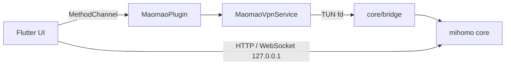

# maomao

基于 [mihomo](https://github.com/MetaCubeX/mihomo) 内核的 Android 代理客户端，使用 Flutter 编写界面，通过 gomobile 将内核以 AAR 形式嵌入。

## 项目结构

```
core/                Go 侧内核封装
  bridge/            对宿主暴露的稳定 API（gomobile 绑定）
  Makefile           AAR 构建脚本
app/                 Flutter 应用
  lib/src/core/      平台通道、内核生命周期
  lib/src/api/       内核 External Controller 客户端（REST + WebSocket）
  lib/src/profile/   订阅拉取、格式转换、override 合并、runtime.yaml 生成
  lib/src/tunnel/    隧道控制
  lib/src/settings/  全局设置
  lib/src/ui/        界面
  android/app/src/main/kotlin/  VpnService、前台通知、快捷设置磁贴
```

## 架构



职责划分遵循两条通道：

- 平台通道 `com.maomao.proxy/core` 只承载生命周期与平台独有能力（启动/停止、VPN 授权、订阅转换、配置校验、已安装应用列表），事件通过 `com.maomao.proxy/core_events` 回传状态与日志。
- 高频只读数据（代理列表、连接、流量、日志）走内核自带的 External Controller。控制器绑定在 `127.0.0.1` 的随机端口上，并使用每次启动生成的随机 secret 鉴权，数据不出设备。

配置分层为 `订阅原文 -> 配置文件级 override -> 全局 override -> runtime.yaml`。订阅原文按原样落盘，因此重新应用 override 不需要重新下载；`runtime.yaml` 在交给隧道之前一定先由内核解析校验。

## 功能

- 订阅导入：支持 mihomo/Clash YAML 与 V2Ray 分享链接列表（可 base64 编码），复用内核自身解析器
- 代理组切换与延迟测试
- 连接、日志、流量实时查看
- TUN 栈可选 gvisor / system / mixed，可开关 IPv6 与内网直连
- 分应用代理（白名单或黑名单）
- 声明式 YAML override：映射递归合并，其他类型整体替换，显式 `null` 删除键
- 启动时自动更新过期订阅
- 快捷设置磁贴开关隧道

## 构建

前置条件：

- Flutter SDK（Dart `^3.13.1`）
- Go `1.26.0` 及 [gomobile](https://pkg.go.dev/golang.org/x/mobile/cmd/gomobile)
- Android SDK 与 NDK（默认 `28.2.13676358`，最低 API 24）

### 1. 构建内核 AAR

```bash
cd core
make android
```

产物输出到 `app/android/app/libs/maomao-core.aar`。默认按 `android/arm64,android/arm,android/amd64` 三个 ABI 编译，构建标签为 `with_gvisor cmfa`。

可通过变量覆盖工具链路径：

```bash
make android ANDROID_SDK=/path/to/sdk NDK_VERSION=28.2.13676358
```

只想快速检查 Go 代码能否编译时用 `make android-check`，它跳过绑定步骤。清理产物用 `make clean`。

### 2. 构建应用

```bash
cd app
flutter pub get
flutter run            # 调试
flutter build apk      # 发布
```

AAR 必须先构建，否则 Gradle 找不到 `libs/maomao-core.aar`。

## 测试

```bash
cd core && go test ./...
cd app && flutter test
```

## 持续集成

- [.github/workflows/ci.yml](.github/workflows/ci.yml)：push 到 `main`、PR 与手动触发时运行。三个并行 job 分别做 `go vet` + `go test`、`flutter analyze` + `flutter test`，以及完整的 AAR + debug APK 构建（APK 作为 artifact 上传）。
- [.github/workflows/release.yml](.github/workflows/release.yml)：推送 `v*` 标签或手动触发时，按 ABI 拆分构建并签名 release APK，重命名为 `maomao-<tag>-<abi>.apk` 后发布到 GitHub Release。

CI 中的 Flutter、Go、NDK 与 gomobile 版本以工作流顶部的 `env` 为准，其中 `GOMOBILE_VERSION` 需与 `core/go.mod` 里的 `golang.org/x/mobile` 保持一致。

### Release 签名

release 工作流需要以下 repository secrets，缺任意一项会在构建开始前直接失败：

| Secret | 说明 |
| --- | --- |
| `KEYSTORE_BASE64` | keystore 文件的 base64 编码 |
| `KEYSTORE_PASSWORD` | keystore 密码 |
| `KEY_ALIAS` | 签名密钥别名 |
| `KEY_PASSWORD` | 签名密钥密码 |

生成 keystore 与 base64：

```bash
keytool -genkeypair -v -keystore upload-keystore.jks \
  -keyalg RSA -keysize 2048 -validity 10000 -alias upload
base64 -i upload-keystore.jks | pbcopy
```

工作流会把 secrets 还原成 `app/android/upload-keystore.jks` 与 `app/android/key.properties`，构建后无论成败都会删除。[app/android/app/build.gradle.kts](app/android/app/build.gradle.kts) 只在 `key.properties` 存在时启用 release 签名配置，否则回退到 debug 签名，因此本地 `flutter build apk --release` 无需 keystore 也能跑通。

keystore 与 `key.properties` 已在 [.gitignore](.gitignore) 中排除，切勿提交。同一应用后续版本必须使用同一 keystore，否则用户无法覆盖安装。

## 许可

MIT，见 [LICENSE](LICENSE)。
